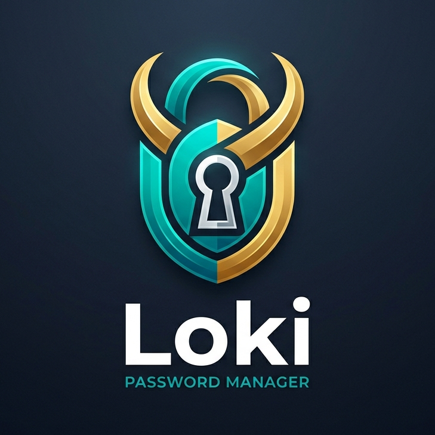
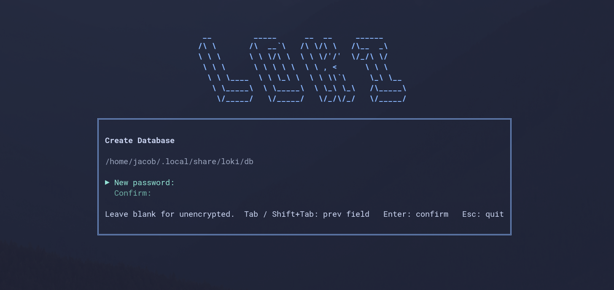
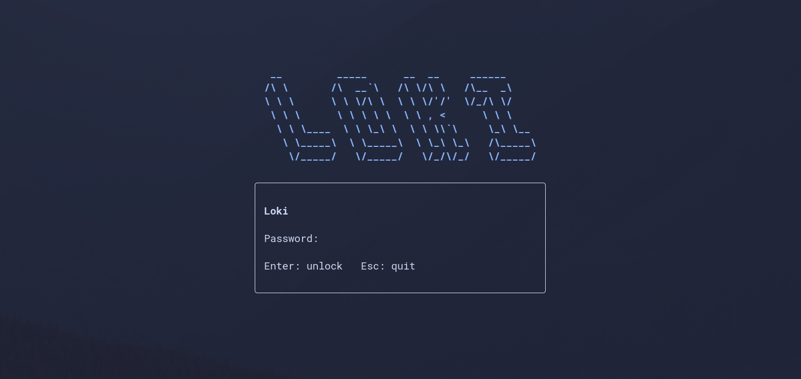
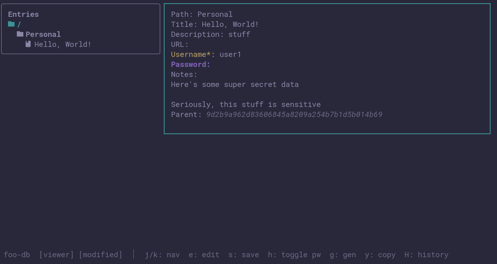
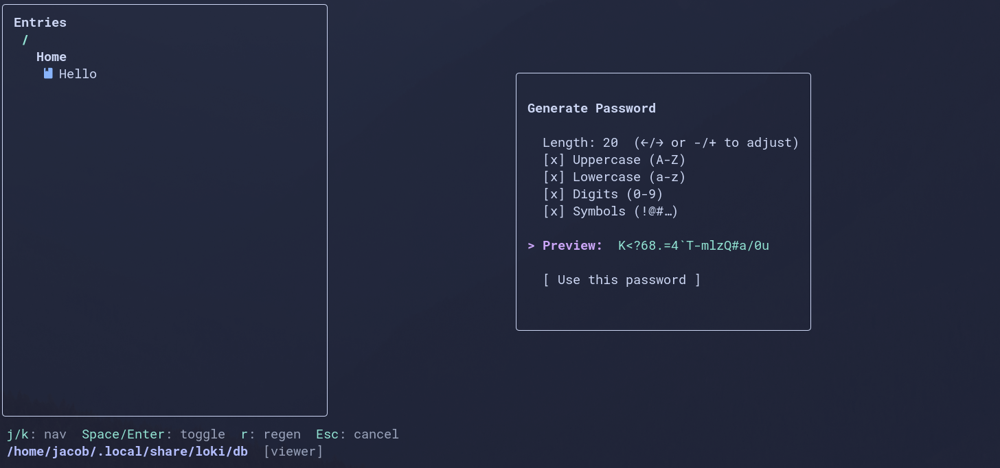
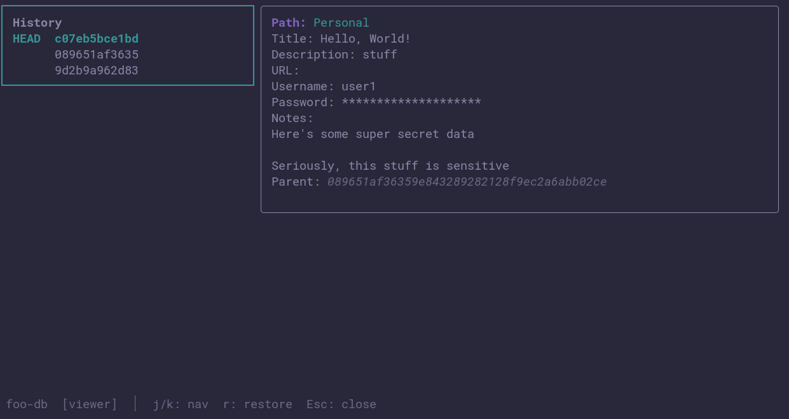
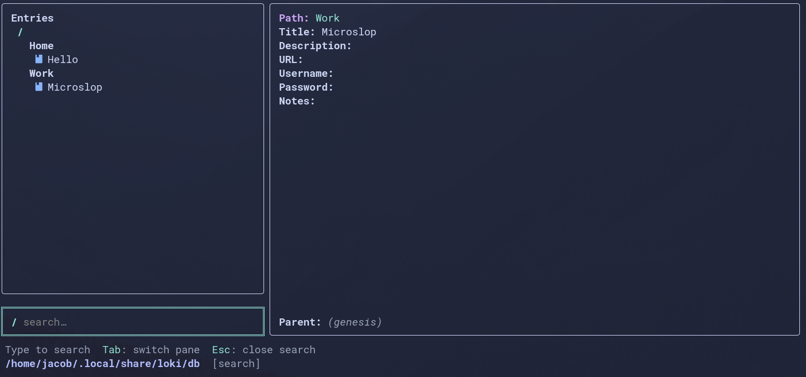

# Loki: Simple Password Manager

Loki is a basic password manager for those wanting full control over their password database,
including where it is stored and how it is synced.

## Motivation

I've long been a fan of [KeePassXC](https://keepassxc.org), but it has one main drawback: syncing
between devices. I've been using Dropbox to sync my `.kdbx` file between my phone, laptop, desktop,
and other computers, but (particularly on Android) Dropbox does not do a good job at syncing files
in a timely manner after changes have been made, leading me to commonly have 4 different copies of
my database that I need to manually review, merge, and then delete.

## Goals

Loki is intended to be a simplified replacement for KeePassXC users just wanting to store usernames,
passwords, URLs, and notes in a secure manner, and sync them reliably between all of their devices,
with no data lost in the process, _ever_.

Loki is essentially feature-complete, with only minor UX improvements planned for the future.

## Features

- Simple TUI interface
- All data is encrypted at rest
- Git-like data storage
- Similar functionality as KeePassXC:
  - Organize entries in folders
  - Entries contain title, description, username, password, URL, and notes
  - Password generator with option to specify length and enable different sets of allowed characters
- Version tracking of all changes
  - See past versions of an entry
  - No data is ever truly lost - roll back to a previous version of an entry at any time
- Automatic fecthing and syncing of a "database" to/from a remote server
  - Git-style push/pull synchronization
  - Ability for the user to interactively resolve vesrion conflicts

## Storage Format

Similar to Git, all entries are stored as binary files inside the Loki database's `objects/`
directory. The filename is the SHA-1 hash of the plaintext contents of the entry, and the contents
are encrypted using the [Argon2id](https://datatracker.ietf.org/doc/rfc9106/) algorithm before
writing to disk.

## TUI Interface

The TUI interface is fairly bare-bones, and was developed using the
[`zigzag` library](https://github.com/meszmate/zigzag). At present, a user may create a new
database, add and "move" existing entries, view the complete history of an entry, generate random
passwords, and copy data to the clipboard for easy logins.

## Android Application

For an Android native application version of Loki, see
[Loki-Android](https://github.com/JacobCrabill/loki-android)

## Documentation

- [Storage Format](./docs/storage-format.md)
- [Network Fetch](./docs/tcp-fetch.md)
- [Network Sync](./docs/tcp-sync.md)
